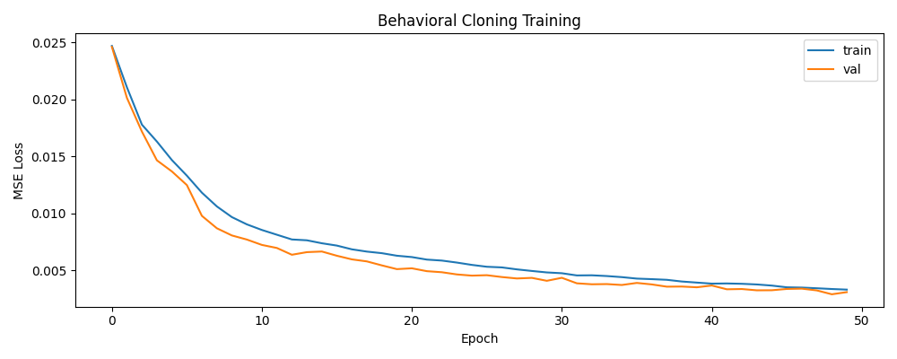

# BeamNG Autopilot

Camera-based lane keeping and adaptive cruise control for a car in the
[BeamNG.tech](https://beamng.tech/) simulator, written in Python with OpenCV,
PyTorch and YOLOv8.

The car drives from a single front camera (plus a depth image from the same
position). Steering comes from two sources that are blended at runtime:

- a classic lane detector (colour threshold, Canny, Hough lines) feeding a PID controller
- a DAVE-2 CNN trained by behavioral cloning on my own driving

When the lane markings are clear the PID does most of the steering. When they
fade or disappear, the weight shifts to the network. Speed is handled by an
ACC loop: YOLOv8 finds the car ahead, the depth image gives the distance,
and a PD controller keeps the gap. The car also slows down in curves.

## How it works

```
                  ┌─> lane detection ──> PID ──┐
camera (RGB) ─────┤                            ├─> blend by lane confidence ─> steering
                  └─> DAVE-2 CNN ──────────────┘

camera (RGB) ───> YOLOv8 ──┐
camera (depth) ────────────┴─> distance to lead car ─> PD + curve slowdown ─> throttle / brake
```

**Lane detection** (`lane_detection.py`). White and yellow paint is picked
out in HLS space, edges are found with Canny inside a trapezoid ROI, and
Hough segments are split into left and right lines by slope. Each line is
fitted as x = m·y + b and smoothed with a median over the last 10 frames.
Pairs with an implausible lane width are rejected. The detector also keeps a
confidence value that rises when both lines are found and falls when they
are lost; that value decides how much the lane PID is trusted.

**Behavioral cloning** (`bc_collect.py`, `bc_train.py`, `dave2.py`). I drove
in freeroam and recorded about 18k frames with the steering angle.
Frames are cropped to the road area, resized to 200×66 and converted to
YUV, as in the NVIDIA paper. Since most driving is straight, near-zero
steering samples are undersampled before training. Augmentation: horizontal
flip (with negated steering), brightness jitter and a little label noise.



**ACC** (`vehicle_detection.py`, `acc.py`). Only cars, buses, trucks and
motorcycles near the middle of the frame count as the lead vehicle. Distance
is the 20th percentile of the depth values inside the box, which ignores
noisy pixels without being thrown off by the background. The controller
uses the gap error and the closing speed, and brakes fully below 5 m.

**Smoothing**. Steering, throttle and brake are all rate limited per control
tick. Without this the car twitches from frame-to-frame noise in the vision
output.

## Scripts

| File | What it does |
|------|--------------|
| `autopilot.py` | Full system: blended steering + ACC + curve slowdown |
| `lane_keeping.py` | Lane detector + PID only, logs every step to CSV for tuning |
| `acc.py` | ACC only, you steer |
| `bc_collect.py` | Record frames and steering while you drive |
| `bc_train.py` | Train DAVE-2 on the recorded data |
| `bc_drive.py` | Drive with the network only |
| `camera_test.py` | Check that BeamNG and the camera work |
| `m5stick_dashboard/` | Speed / RPM / gear display on an M5StickC Plus over WiFi |

## Setup

You need BeamNG.tech, not BeamNG.drive from Steam. The camera and depth
sensors only work with a BeamNG.tech licence (academic licences are available
for free). Tested with BeamNG.tech v0.38.3 and beamngpy 1.35.

```bash
pip install -r requirements.txt
```

Point `BNG_HOME` at your BeamNG.tech folder:

```bash
# Windows
set BNG_HOME=C:\path\to\BeamNG.tech.v0.38.3.0
```

A trained model is included in `models/bc_model.pth`. YOLOv8n is downloaded
automatically the first time.

## Running

```bash
python autopilot.py
```

BeamNG.tech starts on its own (or the script connects to a running one).
Load freeroam, get in a car, and the script picks it up. Then click the
camera window:

| Key | |
|-----|---|
| `A` | autopilot on / off |
| `+` / `-` | cruise speed |
| `D` | debug view (lane mask and ROI edges) |
| `Q` | quit |

To train your own model:

```bash
python bc_collect.py   # drive, press R to record
python bc_train.py
```

## M5Stick dashboard

`beamng_telemetry.py` listens for BeamNG's OutGauge UDP packets and forwards
RPM, speed, gear, throttle and brake to the M5StickC Plus. The Arduino
sketch draws them on the screen. Set your WiFi details in the `.ino` file
and the device IP in the Python script.

## Limitations

- Lane detection is tuned for clear painted lines. It struggles on dirt
  roads, in strong shadows and at junctions; there the network carries most
  of the load.
- The BC model was trained on a fairly small dataset from my own driving,
  so it doesn't generalize much to new maps or conditions.
- ACC treats anything in the middle of the frame as the lead vehicle; there
  is no lane assignment for detected cars.
- No lane changes, traffic lights or route planning.

## License

MIT
